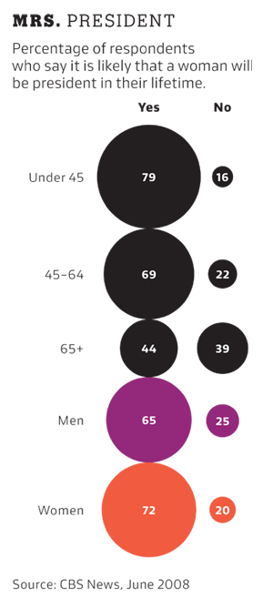

```{r setup, include=FALSE}
knitr::opts_chunk$set(echo = TRUE)
```

```{r load_packages, warning=FALSE, message=FALSE}
library(mdsr)
library(tidyverse)
library(nycflights13)
```
<br>

# Table of contents:
#### 1. The tidyverse packages
#### 2. R Basics
#### 3. Data import/export
#### 4. Visualization
#### 5. Data munging and wrangling
#### 6. EDA
#### 7. Git and Github
<br>

# 1 The tidyverse package
#### Can you name which package is associated with each task below?
  * Plotting - ggplot2
  * Data munging/wrangling - dplyr
  * Reshaping (speading and gathering) data - tidyr
  * Importing/exporting data - read.table (package:utils) / saveRDS (package:base)

#### Now can you name two functions that you’ve used from each package that you listed above for these tasks?
  * Plotting - geom_point, geom_boxplot
  * Data munging/wrangling - select, filter
  * Reshaping data - spread, gather
  * Importing/exporting data (note that readRDS and saveRDS are base R functions) - read.table (package:utils), saveRDS (package:base)
<br>
<br>

# 2 R Basics

### Fix this code with the fewest number of changes possible so it works:
```{r}
My_data.name___is.too00ooLong <- c( 1 , 2   , 3 )
```
### Fix this code so it works:
```{r}
my_string <- c('has', 'an', 'error', 'in', 'it')
```
### Look at the code below and comment on what happened to the values in the vector.
#### It appears that all values have been converted into strings:
```{r}
my_vector <- c(1, 2, '3', '4', 5)
my_vector
```
<br>
<br>

# 3. Data import/export
  * Download the rail_trail.txt file from Canvas (in the Midterm Exam section here) and successfully import it into R. Prove that it was imported successfully by including your import code and taking a glimpse of the result.

  * Export the file into an R-specific format and name it “rail_trail.rds”. Make sure you define the path correctly so that you know where it gets saved. Then reload the file. Include your export and import code and take another glimpse.
```{r}
rail_trail_1 <- read.table("rail_trail.txt", sep="|", header=TRUE)
glimpse(rail_trail_1)

saveRDS(rail_trail_1, file = "rail_trail.rds")

rail_trail_2 <- readRDS(file = "rail_trail.rds")
glimpse(rail_trail_2)
```
<br>
<br>

# 4. Visualization
#### Critique this graphic: give only three examples of what is wrong with this graphic. Be concise.


##### 1) Color is only used to differentiate men and women, it could also be used to distinguish yes from no. Or the other age populations
##### 2) A historgram may be a better way to compare two percentages.
##### 3) The labels on the percentages do not have a % symbol. Unless you happen to read the top, you may not know what this graph is showing. Is it a count?
<br>

#### Reproduce this graphic using the diamonds data set.
```{r}
ggplot(diamonds, aes(x=cut, y=carat, fill=color)) +
geom_boxplot(position='identity', lwd=0.3) +
coord_flip() +
xlab("CUT OF DIAMOND") +
ylab("CARAT OF DIAMOND")
```
<br>

#### The previous graphic is not very useful. We can make it much more useful by changing one thing about it. Make the change and plot it again.
##### We can remove the outliers and adjust the y-axis accordingly. This makes the boxplot more readable, because it is bigger.
```{r}
ggplot(diamonds, aes(x=cut, y=carat, fill=color)) +
geom_boxplot(position='identity', lwd=0.3, outlier.shape = NA) +
coord_flip() +
ylim(c(0.2, 1.3)) +
xlab("CUT OF DIAMOND") +
ylab("CARAT OF DIAMOND")
```
<br>

# 5. Data munging and wrangling
#### Is this data “tidy”? If yes, leave it alone and go to the next problem. If no, make it tidy.
```{r}
spread(table2, type, count)
```
<br>
#### Create a new column in the diamonds data set called price_per_carat that shows the price of each diamond per carat (hint: divide). Only show me the code, not the output.
```{r eval=FALSE}
diamonds["price_per_carat"] <- diamonds$price / diamonds$cara
```
<br>

#### For each cut of diamond in the diamonds data set, how many diamonds, and what proportion, have a price > 10000 and a carat < 1.5? There are several ways to get to an answer, but your solution must use the data wrangling verbs from the tidyverse in order to get credit.
* Do the results make sense? Why? - It appears that although these are outliers, The most expensive small diamonds are of the ideal cut.
* Do we need to be wary of any of these numbers? Why? - They may skew any data that we are looking at with regards to carat vs price.
```{r}
expensive_small_diamonds <- diamonds %>% filter(price > 10000 & carat < 1.5)
print(paste("number of diamonds over $1000 and less than 1.5 carat:", tally(expensive_small_diamonds), sep=" "))
print(paste("number of diamonds over $1000 and less than 1.5 carat over total:", tally(expensive_small_diamonds) / tally(diamonds), sep=" "))

ggplot(data=expensive_small_diamonds, aes(x=cut, y=price)) +
  geom_bar(stat="identity") + scale_y_continuous(labels = scales::comma)

ggplot(data=expensive_small_diamonds, aes(x=color, y=price)) +
    geom_bar(stat="identity") + scale_y_continuous(labels = scales::comma)
```

<br>

# 6. EDA
#### Take a look at the txhousing data set that is included with the ggplot2 package and answer these questions:
```{r}
txhousing
```
<br>

#### 1. During what time period is this data from?
##### Thanks to this stack overflow answer: https://stackoverflow.com/questions/26334763/merge-three-different-columns-into-a-date-in-r I was able to find the range of dates in this data frame. This data is from January 2000, to July 2015
```{r}
range(as.Date(with(txhousing, paste(year, month, 1, sep="-")), "%Y-%m-%d"))
```
<br>

#### 2. How many cities are represented?
```{r}
unique_cities <- unique(txhousing["city"])
NROW(unique_cities)
```
<br>

#### 3. Which city, month and year had the highest number of sales?
##### If we arrange the dataframe by sales in descending order, we can see that the highest sales go to Houston in July of 2015
```{r}
arrange(txhousing,desc(sales))
```
<br>

#### 4. What kind of relationship do you think exists between the number of listings and the number of sales? Check your assumption and show your work.
##### One can see a positive relationship between listings and sales. But it appears that the relationship not as strong once the market has over 1000 listings on it.
```{r warning=F}
ggplot(txhousing, aes(x=listings, y=sales)) + geom_point() + stat_smooth(method = 'lm', aes(colour = 'linear'), se = FALSE)
```
<br>

#### 5. What proportion of sales is missing for each city?
##### Out of the cities that have missing data, these are the proportion of na values over count of entries for that city:
```{r}
na_sales <- txhousing %>% group_by(city) %>% summarise(num_entries = n(), na=sum(is.na(sales))) %>% filter(na > 0)

ggplot(data=na_sales, aes(x=city, y=na/num_entries, fill=na)) +
  geom_text(aes(label = round(na/num_entries, digits = 3)), hjust = -0.25, angle=90) +
  geom_bar(stat="identity") +
  ylim(0.0, 0.8) +
  theme(axis.text.x = element_text(angle = 45, hjust = 1), plot.margin=unit(c(1,1,1.5,1.2),"cm"))
```
<br>

#### 6. Looking at only the cities and months with greater than 500 sales:
#### a) Are the distributions of the median sales price (column name median), when grouped by city, different? The same? Show your work.
<br>

##### I'm not completely sure what this question is asking. But if we look at the data plotted by month vs city. We can see that there is in increase in price for houses sold during the summer time. For the data grouped by city, we can see that each city has it's own median sale value.
```{r}
month_group <- txhousing %>% filter(sales > 500) %>% group_by(month) %>%summarise(sales = sum(sales), median=median(median))
city_group <- txhousing %>% filter(sales > 500) %>% group_by(city) %>% summarise(sales = sum(sales), median=median(median))

ggplot(month_group, aes(x=month, y=median)) + geom_point()
ggplot(city_group, aes(x=city, y=median)) + geom_point() + theme(axis.text.x = element_text(angle = 45))
```
<br>

#### b) Any cities that stand out that you’d want to investigate further?
##### It appears that the city called "Collin County" has the highest median value of all the cities in this dataset. It might be interesting to look at this, since it is so high.
##### By looking at the data, we can see that the highest priced median sale months were in the 300,000s. Also, it is interesting to note that there seems to be a relationship between inventory and sales price. As the inventory gets higher, there is a lower median sales price.
```{r}
collin_county <- txhousing %>% filter(city == "Collin County")

ggplot(collin_county, aes(x=inventory, y=median)) + geom_point()
```
<br>

#### c) Why might we want to filter out all cities and months with sales less than 500
##### Cities with low sales may not represent a large enough sample size, and may pollute our dataset with unreliable data.
<br>

# 7. Git and Github
### My github repo can be found here: (https://github.com/Ukeeyo/compscix4152)
